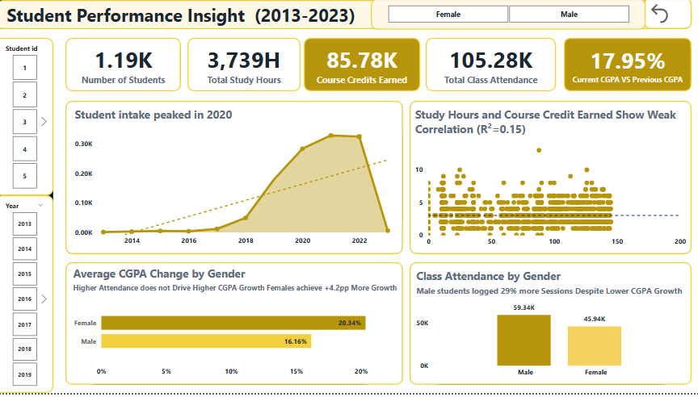

# # Student Performance Insight Dashboard (2013–2023)
Data-driven analysis of academic performance trends using Power BI and SQL-based modeling.

## Project Overview
This project analyzes 10 years of academic data to uncover drivers of student performance and support data-driven decision-making for faculty and academic planners.

## How to Use This Dashboard
-Use the filters to segment performance by gender and year

-Track CGPA trends over time using the line chart

-Compare attendance vs performance using correlation visuals

-Identify high-risk student groups through KPI indicators

## Key Metrics & Definitions
**CGPA Growth Rate** – Measures the change in student academic performance over time (Current CGPA vs Previous CGPA)

**Attendance Rate (%)** – Percentage of classes attended, used to evaluate student engagement levels

**Study Hours per Student** – Total study time allocated per student, used to assess effort intensity

**Course Credits Earned** – Total academic credits successfully completed, indicating progression

**Number of Students** – Total number of students enrolled, used to track intake trends over time

These metrics form the foundation for identifying performance patterns and relationships across the dataset.

##  Key Insights

 **The Attendance Paradox:** Male students recorded 29% higher attendance, yet showed lower CGPA growth, suggesting that attendance alone is not a reliable proxy for academic performance. This points to potential differences in engagement quality rather than presence.

**Weak Correlation:** Study hours explain only 15% of performance variance, indicating that other hidden factors—such as learning methods, prior knowledge, or socio-economic context—play a significantly larger role.

 **Peak Intake:** Enrollment peaked in 2020, creating potential resource strain and signaling the need for scalable academic support systems.

## Tech Stack & Skills
| Component | Technology | Skills Applied |

| **ETL** | Power Query | Data Cleaning, Normalization |

| **Modeling** | Power BI | Star Schema, DAX Measures |

| **Analysis** | Power BI | Trend Forecasting, Correlation (R²) |

| **Design** | Power BI | UI/UX, Visual Hierarchy |

## Business Impact
Enabled faculty to identify underperforming high-attendance segments, allowing targeted academic interventions rather than broad attendance-based policies.

## Collaboration
I’m actively building my data analytics portfolio. Feedback on DAX measures and data modeling is welcome feel free to open an Issue or connect via LinkedIn (https://www.linkedin.com/in/omobolaji-kehinde-a53912402).

## Recommendations
Based on the data trends identified in this analysis, the following actions are recommended for institutional improvement:

### 1.Prioritize analysis of the "Engagement-Growth Gap":
**Observation**: Male students show high attendance but lower CGPA growth.
 **Recommendation**: Deploy targeted surveys to diagnose engagement quality gaps to determine if the current curriculum delivery aligns with male learning styles, or if attendance is "passive" rather than "active."

### 2.Personalized Support for Peak Years:
 **Observation**: Enrollment surged in 2020.
**Recommendation**: Students from high-intake years may require additional career counseling or alumni networking support as they exit the system, ensuring the volume of students doesn't dilute the quality of outcomes.

### 3.Incentivize "Quality over Quantity" Study Habits:
**Observation**: The weak correlation (R2=0.15) between study hours and credits suggests that "more time" isn't necessarily "better time."
**Recommendation**: Introduce structured study-skill programs focusing on high-impact learning techniques (Active Recall, Spaced Repetition) rather than just increasing library hours.

### 4.Expand Data Collection:
**Recommendation**: Integrate "Student Socio-Economic Background" or "Prior Academic History" into the data model. This would likely explain the variance that "Attendance" and "Study Hours" currently fail to capture.

## Limitation
This analysis is limited by the absence of socio-economic and prior academic data, which may significantly influence performance outcomes. Future iterations should incorporate these variables for more robust modeling.
